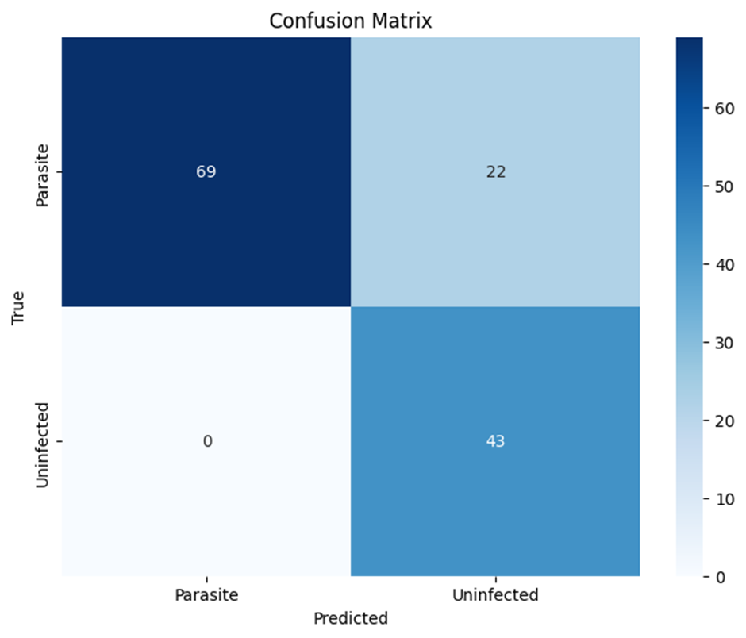
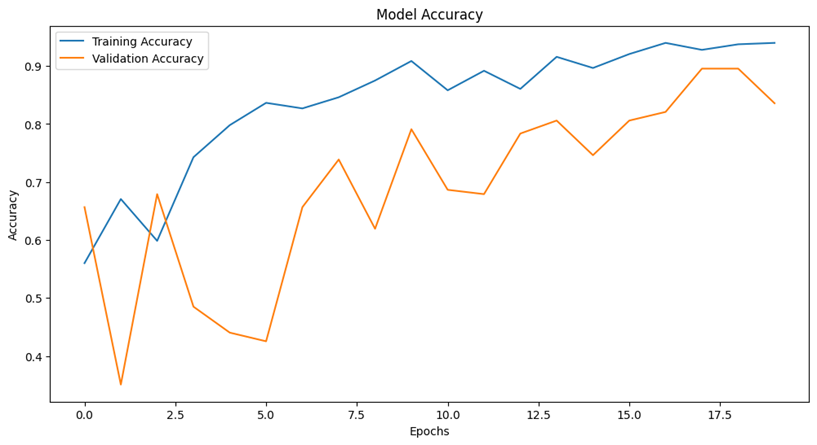
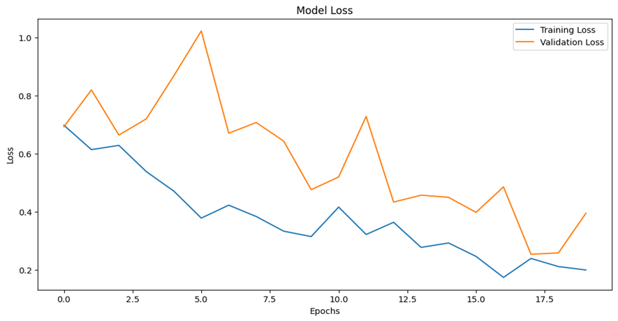
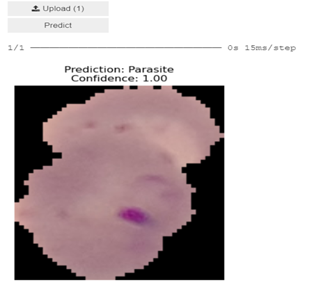

* * * * *

**Malaria Detection Using CNNs**
----------------------------------------

### **1\. Introduction**

-   **Objective**: Develop a Convolutional Neural Network (CNN) to classify cell images into two categories: `Parasite` and `Uninfected`.
-   **Dataset**: Malaria dataset containing cell images divided into `train` and `test` directories:
    -   **Train**:
        -   `Parasite`: 220 images
        -   `Uninfected`: 196 images
    -   **Test**:
        -   `Parasite`: 91 images
        -   `Uninfected`: 43 images
-   **Purpose**: To assist in automated malaria diagnosis using AI, reducing human effort and error.

* * * * *

### **2\. Data Preprocessing and Augmentation**

-   **Rescaling**:
    -   Images were normalized by scaling pixel values to the range `[0, 1]`.
-   **Data Augmentation**:
    -   Rotation: Up to 20 degrees.
    -   Shifts: Width and height shifts up to 20%.
    -   Shearing and zooming.
    -   Horizontal flips.
    -   Fill mode: `nearest`.
-   **Image Size**: Resized to `128x128` pixels.
-   **Batch Size**: `32`.

**Code Snippet**:

```
train_datagen = ImageDataGenerator(
    rescale=1./255,
    rotation_range=20,
    width_shift_range=0.2,
    height_shift_range=0.2,
    shear_range=0.2,
    zoom_range=0.2,
    horizontal_flip=True,
    fill_mode='nearest'
)

test_datagen = ImageDataGenerator(rescale=1./255)

```

* * * * *

### **3\. Model Architecture**

-   **Type**: Sequential CNN model.
-   **Layers**:
    1.  **Convolutional Layers**:
        -   32, 64, and 128 filters of size `(3x3)`.
        -   `ReLU` activation.
        -   Max pooling applied after each convolutional layer.
    2.  **Fully Connected Layers**:
        -   Flattening followed by a dense layer with 128 neurons (`ReLU` activation).
        -   Dropout: 50% to reduce overfitting.
        -   Output layer: 1 neuron with `sigmoid` activation (binary classification).
-   **Optimizer**: Adam.
-   **Loss Function**: Binary crossentropy.
-   **Metrics**: Accuracy.

**Code Snippet**:

```
model = Sequential([
    Conv2D(32, (3, 3), activation='relu', input_shape=(128, 128, 3)),
    MaxPooling2D((2, 2)),
    Conv2D(64, (3, 3), activation='relu'),
    MaxPooling2D((2, 2)),
    Conv2D(128, (3, 3), activation='relu'),
    MaxPooling2D((2, 2)),
    Flatten(),
    Dense(128, activation='relu'),
    Dropout(0.5),
    Dense(1, activation='sigmoid')
])

```

* * * * *

### **4\. Training**

-   **Epochs**: 20
-   **Training Dataset**: Used augmented data generator.
-   **Validation**: Used the test set for validation.

* * * * *

### **5\. Results**

#### **Performance Metrics**

| **Metric** | **Value** |
| --- | --- |
| **Accuracy** | 84% |
| **Weighted F1-Score** | 84% |

#### **Classification Report**

| **Class** | **Precision** | **Recall** | **F1-Score** | **Support** |
| --- | --- | --- | --- | --- |
| Parasite | 1.00 | 0.76 | 0.86 | 91 |
| Uninfected | 0.66 | 1.00 | 0.80 | 43 |
| **Overall** |  |  | **0.84** | **134** |

#### **Confusion Matrix**

```
[[69 22]
 [ 0 43]]

```
#### 

#### **Training and Validation Accuracy**

-   **Training accuracy** improved steadily across epochs.
-   **Validation accuracy** stabilized at ~84%.

#### **Loss Trends**

-   Loss decreased for both training and validation, indicating successful model learning.

* * * * *

### **6\. Graphs**

-   **Accuracy Curve**:
    -   Visualize training vs. validation accuracy over epochs.

    
-   **Loss Curve**:
    -   Visualize training vs. validation loss over epochs.

    

**Example Graphs**:

```
# Plot Accuracy
plt.plot(history.history['accuracy'], label='Training Accuracy')
plt.plot(history.history['val_accuracy'], label='Validation Accuracy')
plt.legend()
plt.title('Accuracy Curve')
plt.show()

# Plot Loss
plt.plot(history.history['loss'], label='Training Loss')
plt.plot(history.history['val_loss'], label='Validation Loss')
plt.legend()
plt.title('Loss Curve')
plt.show()

```

* * * * *

### **7\. Model Saving**

-   The trained model was saved for future use:

```
model.save('malaria_cnn_model_v2.h5')

```

* * * * *

### **8\. Discussion**

-   **Strengths**:
    -   High precision for `Parasite` detection.
    -   Effective data augmentation reduced overfitting.
    -   Simplicity of the architecture ensured computational efficiency.
-   **Weaknesses**:
    -   Recall for `Parasite` (76%) could be improved to reduce false negatives.
    -   `Uninfected` predictions showed lower precision (66%), indicating room for improvement in separating classes.

* * * * *


### **9\. Application: Malaria Detection Interface**

#### **Purpose**

To facilitate easy and intuitive testing of the trained model, an interactive app was developed using Jupyter Notebook widgets. This app allows users to upload cell images and receive predictions about their status (`Parasite` or `Uninfected`) along with confidence scores.

#### **Key Features**

1.  **Image Upload**:
    -   Supports `.jpg`, `.png`, and `.jpeg` file formats.
    -   Single-image upload for focused analysis.
2.  **Prediction**:
    -   Processes the uploaded image.
    -   Classifies the image using the trained CNN model.
    -   Displays the prediction and confidence score.
3.  **Visualization**:
    -   The uploaded image is displayed alongside the predicted class and confidence level.

#### **Code Functionality**

-   **Preprocessing Function**: Resizes the uploaded image to the required input dimensions (`128x128`), normalizes pixel values, and prepares it for prediction.

-   **Prediction Logic**:

    -   The model predicts a probability score for the `Uninfected` class.
    -   Class labels and confidence are derived based on this score:

        ```
        predicted_class = 'Uninfected' if prediction[0] > 0.5 else 'Parasite'
        confidence = prediction[0][0] if prediction[0] > 0.5 else 1 - prediction[0][0]

        ```

-   **Interactive Interface**:

    -   Utilizes widgets for file upload and button-based prediction.
    -   Displays output directly within the notebook, enhancing usability.

#### **User Workflow**

1.  Upload an image of a blood smear.
2.  Click the "Predict" button.
3.  View the result:
    -   Predicted class (`Parasite` or `Uninfected`).
    -   Confidence score (range: 0.00--1.00).
    -   Uploaded image with prediction displayed as a title.

#### **Example Prediction Output**

-   **Input Image**: Blood smear image.
-   **Output**:
    -   Prediction: `Parasite`
    -   Confidence: `0.92`
    -   Display: Uploaded image with a title showing prediction and confidence.

    - 

#### **Code Snippet**

```
# code for preprocessing and prediction
def preprocess_image(image_path):
    img = load_img(image_path, target_size=(128, 128))
    img_array = img_to_array(img) / 255.0
    img_array = np.expand_dims(img_array, axis=0)
    return img_array

def predict_image(image_path):
    img_array = preprocess_image(image_path)
    prediction = model.predict(img_array)
    predicted_class = 'Uninfected' if prediction[0] > 0.5 else 'Parasite'
    confidence = prediction[0][0] if prediction[0] > 0.5 else 1 - prediction[0][0]
    print(f"Prediction: {predicted_class}, Confidence: {confidence:.2f}")

```

#### **Benefits**

-   Simplifies testing for non-technical users.
-   Provides immediate feedback for uploaded samples.
-   Can be extended into a standalone web or mobile application in the future.

* * * * *

### **10\. Conclusion**

The CNN-based malaria detection model achieved an accuracy of **84%**, demonstrating the potential of deep learning in medical diagnostics. Future work could explore:

-   Using pre-trained models for transfer learning.
-   Addressing class imbalance with techniques like oversampling or class weights.
-   Collecting more diverse data to improve generalization.

* * * * *
